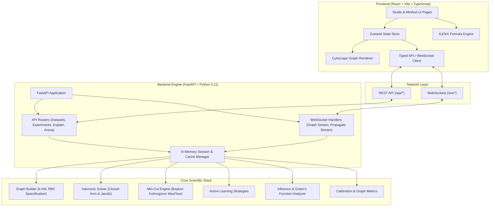

# 🌐 Propagation Studio

<div align="center">

[](https://github.com/rockstar4119/Advanced_Paradigms_in_AI/actions/workflows/ci.yml)
[](https://fastapi.tiangolo.com)
[](https://react.dev)
[](https://vitejs.dev)
[](https://railway.app)
[](https://vercel.com)
[](https://www.python.org/)
[](LICENSE)

<p align="center">
  <strong>Interactive Graph-Based Semi-Supervised Learning & Active Learning Studio</strong>
</p>

<p align="center">
  Explore harmonic energy minimization, graph min-cuts, active learning acquisition strategies, and Green's function influence interpretability in real time with live WebSocket streaming.
</p>

</div>

---

## 📑 Table of Contents

- [Overview](#-overview)
- [Key Features](#-key-features)
- [System Architecture](#-system-architecture)
- [Theoretical & Mathematical Foundations](#-theoretical--mathematical-foundations)
  - [1. Graph Construction & Affinity Matrix](#1-graph-construction--affinity-matrix)
  - [2. Harmonic Energy Minimization (Zhu & Ghahramani)](#2-harmonic-energy-minimization-zhu--ghahramani)
  - [3. Min-Cut / Graph Cuts Classification](#3-min-cut--graph-cuts-classification)
  - [4. Active Learning Query Strategies](#4-active-learning-query-strategies)
  - [5. Interpretability via Green's Functions & Influence](#5-interpretability-via-greens-functions--influence)
- [Project Directory Structure](#-project-directory-structure)
- [Getting Started Locally](#-getting-started-locally)
  - [Prerequisites](#prerequisites)
  - [1. Backend Setup](#1-backend-setup)
  - [2. Frontend Setup](#2-frontend-setup)
  - [3. Running with Docker Compose](#3-running-with-docker-compose)
- [Deployment Guide](#-deployment-guide)
  - [Deploying Backend to Railway](#-deploying-backend-to-railway)
  - [Deploying Frontend to Vercel](#-deploying-frontend-to-vercel)
- [Environment Variables](#-environment-variables)
- [API & WebSocket Reference](#-api--websocket-reference)
- [Running Tests & Quality Checks](#-running-tests--quality-checks)
- [Contributing & License](#-contributing--license)

---

## 🌟 Overview

**Propagation Studio** is a full-stack interactive laboratory designed for understanding, benchmarking, and diagnosing **Graph-Based Semi-Supervised Learning (SSL)** and **Active Learning (AL)** paradigms.

In many real-world machine learning applications, unlabeled data is abundant while acquiring ground-truth labels is costly, time-consuming, or requires human experts. Semi-supervised learning bridges this gap by leveraging the geometric manifold structure of data to propagate label information from a small labeled seed set across the entire graph.

Propagation Studio provides:
- **Real-Time Visual Propagation**: Step-by-step Jacobi relaxation and exact matrix inversion streamed over WebSockets to an interactive Cytoscape graph canvas.
- **Active Learning Arena**: Battle-test acquisition functions (Entropy, Margin Sampling, Information Gain, Graph Centrality, Min-Cut Boundary) against random baselines.
- **Transparent Interpretability**: Inspect Green's function influence matrices, edge homophily, confidence calibration (ECE), and node-level decision boundaries.
- **Interactive Mathematical Documentation**: Built-in interactive textbook with rendered KaTeX formulas detailing every derivation.

---

## ✨ Key Features

- **Interactive Graph Construction**:
  - Synthetic datasets (Two Moons, Concentric Circles, Multi-cluster Blobs) or custom CSV upload with automated feature standardisation and PCA / t-SNE 2D projections.
  - Configurable k-Nearest Neighbors ($k$-NN), $\varepsilon$-neighborhoods, Mutual $k$-NN, and Gaussian/RBF weighting.
  - **Patient Zero** — an outbreak scenario whose labels come from a stochastic SIR cascade running over a contact network, not from a decision boundary. Infection follows *reachability*, so a handful of long-haul flight contacts seed pockets no distance-based method can explain: the failure is small, structured, and diagnosable by the interpretability panels.
- **Dual Semi-Supervised Algorithms**:
  - **Harmonic Functions / Dirichlet Problem**: Continuous relaxation of label propagation with exact Closed-Form matrix solutions and iterative Jacobi streaming.
  - **Min-Cut / Graph Cuts**: Exact combinatorial discrete labeling via maximum flow / minimum $s$-$t$ cut algorithms.
- **Active Learning Simulation Arena**:
  - Step-by-step or automated labeling sweeps across multiple strategies.
  - Live accuracy, macro-F1, and coverage progression curves as queries are answered.
- **Comprehensive Interpretability Suite**:
  - **Influence Explorer**: Measure the precise mathematical influence $\frac{\partial f_u}{\partial f_l}$ of each labeled seed on any unlabeled node.
  - **Node Inspector**: Instant drill-down on node posteriors, margin certainty, neighborhood label purity, and dominant seed attractors.
  - **Diagnostics & Calibration**: Reliability diagrams (Expected Calibration Error), Risk-Coverage trade-off curves, and graph assortativity metrics.
- **Full Evaluation Suite**:
  - **Agreement & balance**: balanced accuracy, macro / weighted F1, macro precision-recall, Cohen's kappa, and multiclass Matthews correlation — chance-corrected scores that an imbalanced graph cannot inflate.
  - **Posterior quality** (harmonic): mean entropy and margin, one-vs-rest macro AUROC, multiclass Brier score, log loss, and a confidence-minus-accuracy gap that flags overconfidence. Min-cut returns a hard partition and says so instead of inventing a posterior.
- **Timeline Playback**:
  - Runs animate themselves — build, propagate, and cut steps play on a client-side clock at 0.5×–4× rather than at whatever speed the socket happened to deliver.
  - Scrub or step backwards to any earlier moment; the canvas rewinds and replays, so past states are genuinely reconstructed rather than left painted over.
- **Modern Responsive Interface**:
  - High-performance dark UI built with React 18, TypeScript, and Cytoscape.js.
  - Zero-lag rendering with custom layout animations, spring physics, and color interpolation.

---

## 🏗️ System Architecture



---

## 📐 Theoretical & Mathematical Foundations

### 1. Graph Construction & Affinity Matrix
Given a dataset $\mathcal{X} = \{x_1, \dots, x_n\} \subset \mathbb{R}^d$, we construct a weighted affinity matrix $W \in \mathbb{R}^{n \times n}$ using Gaussian Radial Basis Function (RBF) kernel weights:

$$W_{ij} = \begin{cases} \exp\left(-\frac{\|x_i - x_j\|^2}{2\sigma^2}\right) & \text{if } x_j \in \mathcal{N}_k(x_i) \text{ or } x_i \in \mathcal{N}_k(x_j) \\ 0 & \text{otherwise} \end{cases}$$

The diagonal degree matrix $D$ is defined as $D_{ii} = \sum_j W_{ij}$, and the unnormalized Graph Laplacian is $\mathcal{L} = D - W$.

### 2. Harmonic Energy Minimization (Zhu & Ghahramani)
Partition node indices into labeled nodes $L = \{1, \dots, l\}$ and unlabeled nodes $U = \{l+1, \dots, l+u\}$. The harmonic function $f: V \to \mathbb{R}^C$ satisfies the **Dirichlet boundary conditions** $f(x_i) = y_i$ for $i \in L$, while minimizing the harmonic energy:

$$\mathcal{E}(f) = \frac{1}{2} \sum_{i,j=1}^n W_{ij} \|f(i) - f(j)\|^2 = \operatorname{Tr}(f^T \mathcal{L} f)$$

Setting $\frac{\partial \mathcal{E}}{\partial f_u} = 0$ yields the **Harmonic property** $\Delta f(u) = 0$:

$$f_u = (D_{uu} - W_{uu})^{-1} W_{ul} f_l = (I - P_{uu})^{-1} P_{ul} f_l$$

where $P = D^{-1} W$ is the transition matrix of a random walk on the graph. In iterative mode, the solution is solved via **Jacobi relaxation**:

$$f_u^{(t+1)} = P_{uu} f_u^{(t)} + P_{ul} f_l$$

### 3. Min-Cut / Graph Cuts Classification
For discrete binary classification ($y_i \in \{-1, +1\}$), the problem is mapped to an exact minimum $s$-$t$ cut on a flow network with source $s$ and sink $t$:
- Edge capacities between node pairs $(i, j)$ are set to $W_{ij}$.
- Infinite capacity terminals connect labeled positive seeds to $s$ and negative seeds to $t$.
- The cut partition separating $s$ and $t$ with minimal total edge weight gives the globally optimal label assignment.

### 4. Active Learning Query Strategies
Active Learning queries the most informative unlabeled point $x^* \in U$ to request a label:

| Strategy | Formulation | Motivation |
| :--- | :--- | :--- |
| **Entropy** | $x^* = \arg\max_{i \in U} \left[ -\sum_{c} P(y_i=c) \log P(y_i=c) \right]$ | Queries points with maximum posterior ambiguity. |
| **Margin Sampling** | $x^* = \arg\min_{i \in U} \left( P(y_i=c_1) - P(y_i=c_2) \right)$ | Queries points nearest to the decision boundary. |
| **Least Confidence** | $x^* = \arg\max_{i \in U} \left( 1 - \max_c P(y_i=c) \right)$ | Targets points with the weakest single-class belief. |
| **Graph Centrality** | $x^* = \arg\max_{i \in U} \sum_{j \in \mathcal{N}_k(i)} W_{ij}$ | Prioritizes dense, well-connected cluster centers. |
| **Information Gain** | $x^* = \arg\max_{i \in U} \Delta H(\text{Graph})$ | Maximizes global graph uncertainty reduction. |

### 5. Interpretability via Green's Functions & Influence
The influence of a labeled seed $l \in L$ on an unlabeled node $u \in U$ is given by the derivative of the harmonic solution:

$$\mathcal{I}(l \to u) = \frac{\partial f_u}{\partial f_l} = \left[(D_{uu} - W_{uu})^{-1} W_{ul}\right]_{u, l}$$

This matrix corresponds to the discrete Green's function of the graph Laplacian with Dirichlet boundary conditions, measuring the hitting probability of a random walk starting at $u$ first reaching labeled node $l$.

---

## 📂 Project Directory Structure

```text
Paradigms_AI/
├── .github/
│   └── workflows/
│       ├── ci.yml                    # Automated CI testing & building
│       ├── deploy-railway.yml        # Railway automated deployment pipeline
│       └── deploy-vercel.yml         # Vercel automated deployment pipeline
├── backend/
│   ├── app/
│   │   ├── api/                      # REST API routers
│   │   │   ├── arena.py              # Active learning arena endpoints
│   │   │   ├── datasets.py           # Dataset generation & upload endpoints
│   │   │   ├── experiments.py        # Label efficiency sweep endpoints
│   │   │   └── explain.py            # Graph diagnostics & influence endpoints
│   │   ├── core/                     # Scientific computing & algorithm engines
│   │   │   ├── label_propagation/    # Harmonic & MinCut algorithms
│   │   │   │   ├── harmonic.py       # Harmonic function solver (Jacobi / Closed)
│   │   │   │   └── mincut.py         # Max-flow / Min-cut graph solver
│   │   │   ├── active_learning.py    # Active learning acquisition functions
│   │   │   ├── datasets.py           # Synthetic dataset generator
│   │   │   ├── dimensionality.py     # PCA / t-SNE projection
│   │   │   ├── graph_builder.py      # k-NN & RBF adjacency matrix builder
│   │   │   ├── graph_explain.py      # Homophily, assortativity, components
│   │   │   ├── graph_metrics.py      # Graph topology statistics
│   │   │   ├── influence.py          # Green's function influence engine
│   │   │   ├── label_efficiency.py   # Label fraction sweep evaluation
│   │   │   ├── metrics.py            # Accuracy, Macro-F1, ECE, Risk-Coverage
│   │   │   └── state.py              # In-memory session state store
│   │   ├── tests/                    # Pytest test suite (39 integration & unit tests)
│   │   ├── ws/                       # WebSocket real-time stream handlers
│   │   │   ├── graph_ws.py           # Graph layout streaming
│   │   │   └── propagate_ws.py       # Jacobi iteration streaming
│   │   ├── config.py                 # Application settings & CORS configuration
│   │   ├── main.py                   # FastAPI app entrypoint & health checks
│   │   └── schemas.py                # Pydantic request/response schemas
│   ├── .env.example                  # Backend environment template
│   ├── .gitignore                    # Backend gitignore
│   ├── Dockerfile                    # Container definition for backend
│   ├── nixpacks.toml                 # Nixpacks build configuration for Railway
│   ├── Procfile                      # Process file for cloud hosts
│   ├── pyproject.toml                # Pytest & packaging configuration
│   ├── railway.json                  # Railway service configuration
│   └── requirements.txt              # Python dependencies
├── frontend/
│   ├── src/
│   │   ├── components/               # Modular UI components
│   │   │   ├── arena/                # Active learning controls & charts
│   │   │   ├── method/               # Interactive mathematical derivations
│   │   │   ├── AlgorithmControls.tsx # Hyperparameter & method controls
│   │   │   ├── CalibrationChart.tsx  # Reliability diagram (ECE)
│   │   │   ├── DatasetSelector.tsx   # Dataset & seed ratio selection
│   │   │   ├── GraphCanvas.tsx       # Cytoscape interactive graph view
│   │   │   ├── GraphDiagnosticsPanel.tsx
│   │   │   ├── NodeInspector.tsx     # Node inspection & influence breakdown
│   │   │   └── PlaybackControls.tsx  # Step, Play, Pause, Reset animation
│   │   ├── hooks/                    # Custom React hooks (Store, HashRoute)
│   │   ├── lib/
│   │   │   └── api.ts                # Typed REST & WebSocket client
│   │   ├── pages/
│   │   │   ├── ArenaPage.tsx         # Active Learning Arena
│   │   │   ├── MethodPage.tsx        # Mathematical Textbook
│   │   │   └── StudioPage.tsx        # Graph SSL Studio Workspace
│   │   ├── styles/                   # Modern CSS design system
│   │   ├── types/                    # TypeScript interfaces & definitions
│   │   ├── App.tsx                   # Main App layout & route management
│   │   └── main.tsx                  # React DOM root entry
│   ├── .env.example                  # Frontend environment template
│   ├── .gitignore                    # Frontend gitignore
│   ├── Dockerfile                    # Production Nginx container
│   ├── nginx.conf                    # Nginx SPA fallback configuration
│   ├── package.json                  # Node dependencies & scripts
│   ├── tsconfig.json                 # TypeScript compiler configuration
│   ├── vercel.json                   # Vercel deployment configuration
│   └── vite.config.ts                # Vite build configuration
├── .env.example                      # Root environment template
├── .gitignore                        # Global repository gitignore
├── docker-compose.yml                # Multi-container local orchestration
├── railway.json                      # Root Railway monorepo deployment config
├── vercel.json                       # Root Vercel monorepo deployment config
└── README.md                         # Comprehensive project documentation
```

---

## 🚀 Getting Started Locally

### Prerequisites
- **Python**: Version `3.11` or higher
- **Node.js**: Version `18.0.0` or higher (Node 20 LTS recommended)
- **Git**

---

### 1. Backend Setup

1. Navigate to the `backend` folder:
   ```bash
   cd backend
   ```

2. Create and activate a Python virtual environment:
   - **macOS / Linux**:
     ```bash
     python3 -m venv .venv
     source .venv/bin/activate
     ```
   - **Windows (PowerShell)**:
     ```powershell
     python -m venv .venv
     .venv\Scripts\Activate.ps1
     ```

3. Install required dependencies:
   ```bash
   pip install --upgrade pip
   pip install -r requirements.txt
   ```

4. Create your local environment file:
   ```bash
   cp .env.example .env
   ```

5. Start the FastAPI development server:
   ```bash
   uvicorn app.main:app --host 127.0.0.1 --port 8000 --reload
   ```

The backend is now live at [http://127.0.0.1:8000](http://127.0.0.1:8000).  
Interactive Swagger API documentation is available at [http://127.0.0.1:8000/docs](http://127.0.0.1:8000/docs).

---

### 2. Frontend Setup

1. Open a new terminal and navigate to the `frontend` folder:
   ```bash
   cd frontend
   ```

2. Install Node dependencies:
   ```bash
   npm install
   ```

3. Create your frontend environment configuration:
   ```bash
   cp .env.example .env
   ```

4. Start the Vite development server:
   ```bash
   npm run dev
   ```

5. Open your browser at [http://localhost:5173](http://localhost:5173).

---

### 3. Running with Docker Compose

Run the entire full-stack application with a single command:

```bash
docker compose up --build
```

- **Frontend**: [http://localhost:3000](http://localhost:3000)
- **Backend API**: [http://localhost:8000](http://localhost:8000)
- **Interactive Swagger Docs**: [http://localhost:8000/docs](http://localhost:8000/docs)

---

## 🚢 Deployment Guide

This project is pre-configured with zero-friction deployment settings for **Railway** (Backend) and **Vercel** (Frontend).

---

### 🚂 Deploying Backend to Railway

[Railway](https://railway.app) provides native Docker and Python support with persistent WebSockets.

#### Option A: Deploy via GitHub Integration (Recommended)
1. Push your code to your GitHub repository.
2. Log in to [Railway](https://railway.app) and click **"New Project"**.
3. Select **"Deploy from GitHub repo"** and choose this repository.
4. If deploying from repository root:
   - Railway will automatically detect [`railway.json`](railway.json) or [`backend/Dockerfile`](backend/Dockerfile).
   - In service **Settings** $\to$ **General** $\to$ **Root Directory**, set `/backend` (or leave root with the included `railway.json`).
5. In service **Variables**, add the following:
   ```env
   PORT=8000
   CORS_ORIGIN_REGEX=https?://(localhost|127\.0\.0\.1)(:\d+)?|https://.*\.vercel\.app
   ```
6. In service **Networking**, click **"Generate Domain"** to get your public backend URL:
   ```text
   https://propagation-studio-backend.up.railway.app
   ```
7. Verify that `https://your-backend.up.railway.app/health` returns `{"status":"ok"}`.

---

### ▲ Deploying Frontend to Vercel

[Vercel](https://vercel.com) provides edge hosting and global CDN distribution for the Vite frontend.

#### Step-by-Step Deployment:
1. Log in to [Vercel](https://vercel.com) and click **"Add New Project"**.
2. Select your GitHub repository.
3. In the project configuration modal:
   - **Framework Preset**: `Vite`
   - **Root Directory**: Click "Edit" and select `frontend` (or leave default to use root [`vercel.json`](vercel.json)).
   - **Build Command**: `npm run build`
   - **Output Directory**: `dist`
4. Expand **Environment Variables** and add:
   ```text
   VITE_API_URL = https://your-backend.up.railway.app
   ```
   *(Replace with your actual Railway backend URL from the previous step)*
5. Click **"Deploy"**.
6. Once built, your frontend is live with automatic SSL, SPA routing, and WebSocket bridging!

---

## ⚙️ Environment Variables

### Backend (`backend/.env`)

| Variable | Type | Default | Description |
| :--- | :--- | :--- | :--- |
| `PORT` | `int` | `8000` | Port for the Uvicorn ASGI server (dynamically provided by Railway). |
| `HOST` | `str` | `0.0.0.0` | Network binding interface. |
| `CORS_ORIGINS` | `str` | `http://localhost:5173,http://127.0.0.1:5173,...` | Comma-separated list of allowed origins. |
| `CORS_ORIGIN_REGEX`| `str` | `https?://(localhost\|127\.0\.0\.1)(:\d+)?\|https://.*\.vercel\.app` | Regular expression matching authorized client origins. |
| `MAX_DATASET_SIZE` | `int` | `500` | Maximum allowable number of sample points per dataset. |
| `DEFAULT_K` | `int` | `6` | Default number of nearest neighbors for graph construction. |
| `DEFAULT_SIGMA` | `float`| `1.0` | Default Gaussian RBF kernel bandwidth parameter. |
| `DEFAULT_MAX_ITER` | `int` | `200` | Maximum iterations for Jacobi harmonic solver. |
| `DEFAULT_TOL` | `float`| `1e-4` | Convergence tolerance threshold ($\|f^{(t+1)} - f^{(t)}\|_\infty$). |
| `SESSION_TTL_SECONDS`| `int` | `3600` | Time-to-live for in-memory graph session state cache. |
| `STREAM_DELAY_SECONDS`| `float`| `0.01` | Frame throttling delay for WebSocket iteration streams. |

### Frontend (`frontend/.env`)

| Variable | Type | Default | Description |
| :--- | :--- | :--- | :--- |
| `VITE_API_URL` | `str` | `http://127.0.0.1:8000` | Base URL of the backend API (HTTP / HTTPS). WebSockets automatically map to WS / WSS. |

---

## 📡 API & WebSocket Reference

### REST Endpoints

- `GET /health` — Health check endpoint for uptime monitoring and load balancers.
- `POST /api/datasets/generate` — Generate synthetic datasets (`two_moons`, `circles`, `blobs`, `patient_zero`).
- `POST /api/datasets/upload` — Upload custom CSV datasets with automatic dimensionality reduction.
- `POST /api/experiments/{session_id}/label-efficiency` — Execute sweep over varying label fractions.
- `GET /api/explain/{session_id}/graph` — Retrieve topology diagnostics, edge weights, and assortativity.
- `GET /api/explain/{session_id}/influence` — Compute harmonic Green's function influence matrices.
- `GET /api/explain/{session_id}/node/{node_id}` — Query granular node statistics and seed attractors.
- `GET /api/explain/{session_id}/result` — Retrieve accuracy, calibration curves (ECE), and risk-coverage.
- `POST /api/arena/{session_id}/start` — Initialize an Active Learning Arena competition.
- `POST /api/arena/{session_id}/step` — Advance active learning acquisition step across strategies.
- `DELETE /api/arena/{session_id}` — Reset active learning arena session state.

### WebSocket Protocols

- `ws://<HOST>/ws/graph/{session_id}`:
  - Streams graph construction progress, node coordinate layouts, and edge affinity updates.
- `ws://<HOST>/ws/propagate/{session_id}`:
  - Streams real-time Jacobi relaxation steps containing per-node soft probability vectors and convergence residuals.

---

## 🧪 Running Tests & Quality Checks

### Run Backend Pytest Suite
The backend includes 39 unit and integration tests covering active learning, graph construction, harmonic relaxation, min-cut, influence functions, and API routing:

```bash
cd backend
python -m pytest app/tests -v
```

### Run Frontend Typecheck & Production Build
```bash
cd frontend
npm run build
```

---

## 📄 Contributing & License

Contributions, issue reports, and pull requests are welcome!

Distributed under the **MIT License**. See `LICENSE` for more information.
